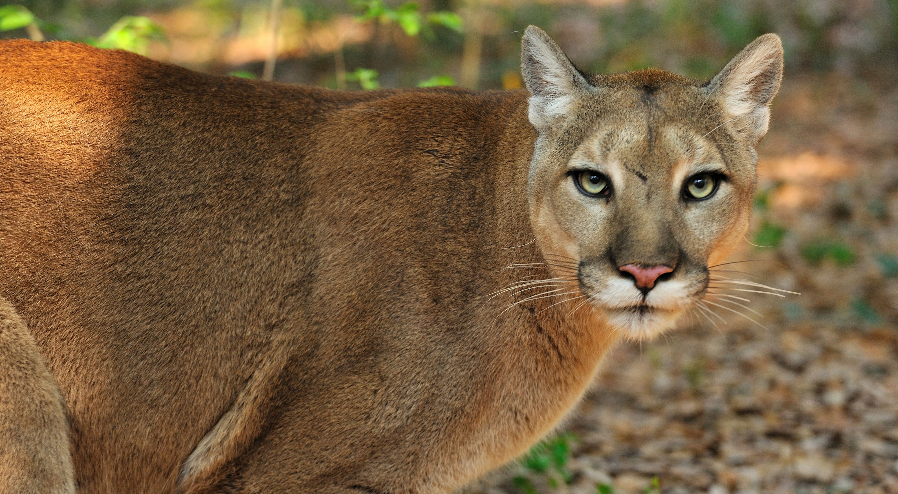
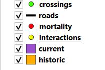

# Florida Panther Storymap

_This final project was created for GEOG 458 with Bo Zhao at the University of Washington_

> _image from [nature.org](https://www.nature.org/en-us/about-us/where-we-work/united-states/florida/stories-in-florida/save-the-florida-panther/_)_

## Description and Elements
This project is a simple storymap raising awareness for the Florida Panthers. Through several scenes the user will see different maps showing data relating to the panthers' interactions, old and current habitat, mortality, and wildlife crossings. Accompanying each scene is a brief description that contextualizes the map that it overlays along with a legend in the upper right. The user can simply scroll down the page to visit each scene or select a navigation arrow found on the bottom left. Lastly, an information icon is found in the upper left which when clicked, opens a modal detailing the purpose of the story map, data sources used, and references to the articles where the information was found.

## Goal
Florida panthers are the **most endangered species** in the United States and one of the most endangered in the world. When thinking about endangered species, the general audience might think of rhinos, pandas, or bengal tigers but there are many species on the verge of extinction that are very close by.

In an attempt to raise awareness about this declining species towards a US audience, this story map will take its users through various aspects pertaining to **Puma Concolor Coryi**, the Florida Panther. My hope is that thinking about and becoming aware  of this fragile species might cause the user to think, _"What other species are there around me that I don't know about?"_ and start researching. While the Florida Panther was used as a case study because it is most immediately threatened by extinction, the American Pika is another species prevalent in the upper regions of the Cascade Mountains under threat. Living in the Pacific Northwest, I used to have no idea that the population of these cute animals is rapidly declining. Ideally, this newfound realization will lead individuals to get involved in conservation even if it is just on a local scale.

## Data Sources

The following table lists the data used within this storymap. Those with an asterisk (*) were created by me using [`geojson.io`](http://geojson.io/) with a reference image to create the shape. For the rest of the datasets, I uploaded the shapefile onto `geojson.io` to convert it to geojson to be used with `leaflet`. Images and other resources used are attributed in the project.

| Data   | Description  | Source |
|--------|--------------|--------|
| `crossings.geojson`       |   Points showing the wildlife crossings built in Florida          |   [FWC](http://geodata.myfwc.com/datasets/da8f537fae4042799b1d2aff8a77642b_1?geometry=-81.911%2C26.086%2C-80.868%2C26.301)     |
|  *`current.geojson`      |  **Polygon** showing the current habitat of Florida Panthers           |  [USGS](https://www.sciencebase.gov/catalog/item/59f5e20ae4b063d5d307dc45)      |
|  *`historic.geojson`      |   **Polygon** showing the historic habitat of Florida Panthers before the arrival of European Settlers           |  [University of Florida](https://www.researchgate.net/publication/273968104_The_Florida_Panther_Past_Present_and_Future#pf1)      |
|  `interactions.geojson`      |   **Points** showing the confirmed interactions between humans and Florida Panthers from 2004 to 2018           |   [Florida GIS Data Portal](http://geodata.myflorida.com/datasets/myfwc::confirmed-human-florida-panther-interactions)     |
|  `mortality.geojson`      |   **Points** showing dead Florida Panthers from 1972 to 2020          |  [FWC](http://geodata.myfwc.com/datasets/3aa8eaa2a5ee4ce9912ad4d1edd8f613_7)      |
|  *`roads.geojson`         |   Polyline showing two major roads on which wildlife crossings were built           |   -     |

> Layers in QGIS GUI
>
> 

## Applied Libraries and Web Services

This project takes advantage of `storymap.js` built by [Bo Zhao](https://github.com/jakobzhao/). It is an open-source library similar to ESRI's ArcGIS StoryMap. In comparison it is lightweight and flexible as it allows for consolidation of data beyond what is stored on ArcGIS. Since the content of this project didn't require some of the more heavy-duty features available in other storytelling libraries, this was a great fit. _Source: [storymap.js](https://github.com/jakobzhao/storymap)_. Given that this project only handles static files, **Github Pages** was used as the hosting web service

`storymap.js` has the following dependencies:

| Technology | Description |
|---------|-------------|
|   `jQuery`      |    JavaScript library for fast and more readable DOM manipulation, event handling, and Ajax         |
|   `Bootstrap 4`      |   Framework for quickly building structure with easy to use CSS properties          |
|  `Leaflet`      |  JavaScript library for  building interactive web maps        |
|   `Google Material Icon`      |   Icons using Google's material design language          |

---

## Acknowledgement

> Special thanks to Professor Bo Zhao for teaching me the skills used to create this project and for encouraging me to think mote critically about the significance if digital geographies. More thanks to those that provided feedback following the presentation of this project.

### References

- The [background video](https://www.youtube.com/watch?v=t-TiDWndD-4") on the front page was clipped from Youtube.
- [For Florida Panthers, Extinction Comes on 4 Wheels](https://blogs.scientificamerican.com/extinction-countdown/for-florida-panthers-extinction-comes-on-4-wheels/)
- [US Fish and Wildlife Service](https://www.fws.gov/refuge/florida_panther/wah/panther.html#:~:text=The%20Florida%20panther%20is%20a,in%20the%20eastern%20United%20States.)
- [National Geographic](https://blog.nationalgeographic.org/2016/06/22/how-one-rescued-florida-panther-is-everybodys-florida-panther/)
- [The National Wildlife Federation](https://www.nwf.org/Educational-Resources/Wildlife-Guide/Mammals/Florida-Panther#:~:text=Florida%20panthers%20are%20about%20six,the%20southwestern%20tip%20of%20Florida.)
- [The Nature Conservancy](https://www.nature.org/en-us/about-us/where-we-work/united-states/florida/stories-in-florida/save-the-florida-panther/)

